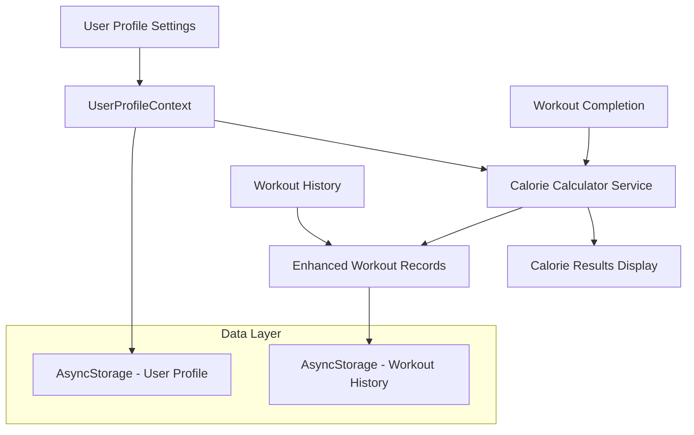

# Design Document - Calorie Tracking System

## Overview

The Calorie Tracking System will integrate seamlessly with the existing Ashto fitness app to provide users with accurate, personalized calorie burn estimates. The system leverages scientifically-backed MET (Metabolic Equivalent of Task) values and user profile data to calculate calories burned during workouts. The design builds upon the existing calorie calculator utility and user profile context while extending the Settings tab UI and workout completion flow.

## Architecture

### High-Level Architecture



### Component Architecture

The system consists of four main architectural layers:

1. **Presentation Layer**: Enhanced Settings UI, Workout Summary Modal, Profile Input Forms
2. **Context Layer**: Extended UserProfileContext with profile completeness validation
3. **Service Layer**: Enhanced calorie calculation service with MET-based algorithms
4. **Data Layer**: AsyncStorage persistence for user profiles and workout history with calorie data

## Components and Interfaces

### 1. Enhanced User Profile Management

#### UserProfile Interface (Extended)
```typescript
interface UserProfile {
  age: number;
  sex: 'male' | 'female' | 'other';
  weight: number; // in kg
  height: number; // in cm
  activityLevel: 'sedentary' | 'lightly_active' | 'moderately_active' | 'very_active' | 'extremely_active';
  weightUnit: 'kg' | 'lbs';
  heightUnit: 'cm' | 'ft_in';
  createdAt: string;
  updatedAt: string;
}
```

#### Profile Input Components
- **WeightInput**: Supports both kg/lbs with unit conversion
- **HeightInput**: Supports both cm/ft-in with unit conversion  
- **AgeInput**: Numeric input with validation (13-120 years)
- **SexSelector**: Radio button group for male/female/other
- **ActivityLevelSelector**: Dropdown for activity level selection

### 2. Enhanced Settings Tab

The Settings tab will be extended with a new "Personal Information" section that includes:

- Collapsible profile section with completion status indicator
- Form validation with real-time feedback
- Unit conversion utilities
- Profile completeness progress bar
- Data persistence confirmation messages

### 3. Calorie Calculation Service (Enhanced)

#### Core Calculation Engine
The existing `calorieCalculator.ts` will be enhanced with:

```typescript
interface CalorieCalculationResult {
  totalCalories: number;
  exerciseBreakdown: ExerciseCalorieBreakdown[];
  averageMET: number;
  calculationMethod: 'complete_profile' | 'default_values';
  profileCompleteness: number;
  recommendations?: string[];
}

interface ExerciseCalorieBreakdown {
  name: string;
  calories: number;
  intensity: 'light' | 'moderate' | 'vigorous';
  metValue: number;
  duration: number;
  category: string;
}
```

#### MET Value Database
Enhanced MET values based on the 2011 Compendium of Physical Activities:

- **Strength Training**: 3.5-6.0 MET (intensity-based)
- **Cardio Activities**: 4.0-12.0 MET (type and intensity-based)
- **Bodyweight Exercises**: 3.0-8.0 MET (exercise-specific)
- **Hybrid Activities**: Calculated using weighted averages

#### Personalization Factors
- **Sex-based adjustments**: 5-10% metabolic difference for females
- **BMI adjustments**: ±10% based on body composition
- **Age adjustments**: Metabolic rate decline consideration
- **Fitness level adjustments**: Activity level multipliers

### 4. Workout Summary Modal

#### WorkoutSummaryModal Component
```typescript
interface WorkoutSummaryProps {
  visible: boolean;
  onClose: () => void;
  workoutData: WorkoutData;
  calorieResult: CalorieCalculationResult;
  userProfile: UserProfile | null;
}
```

Features:
- Animated calorie counter display
- Exercise-by-exercise breakdown
- Profile completeness warnings
- Recommendations for profile improvement
- Social sharing capabilities (future enhancement)

### 5. Enhanced Workout History

#### Extended Workout Record
```typescript
interface WorkoutRecord {
  id: string;
  date: string;
  exercises: Exercise[];
  duration: number;
  calorieData?: {
    totalCalories: number;
    calculationMethod: string;
    profileSnapshot: Partial<UserProfile>;
  };
  notes?: string;
}
```

## Data Models

### 1. User Profile Data Model

```typescript
class UserProfileManager {
  static async saveProfile(profile: UserProfile): Promise<void>
  static async loadProfile(): Promise<UserProfile | null>
  static validateProfile(profile: Partial<UserProfile>): ValidationResult
  static calculateCompleteness(profile: UserProfile | null): number
  static getDefaultProfile(): UserProfile
}
```

### 2. Calorie Calculation Data Model

```typescript
class CalorieCalculationEngine {
  static calculateWorkoutCalories(
    workoutData: WorkoutData,
    userProfile: UserProfile | null,
    exerciseCategories: Record<string, string>
  ): CalorieCalculationResult
  
  static getMETValue(
    exercise: Exercise,
    intensity: IntensityLevel,
    category: string
  ): number
  
  static applyPersonalizationFactors(
    baseCalories: number,
    userProfile: UserProfile
  ): number
}
```

### 3. Workout History Data Model

```typescript
class WorkoutHistoryManager {
  static async saveWorkoutWithCalories(
    workout: WorkoutData,
    calorieResult: CalorieCalculationResult
  ): Promise<void>
  
  static async getWorkoutHistory(
    weeks: number
  ): Promise<WorkoutRecord[]>
  
  static calculateWeeklyCalorieTrends(
    history: WorkoutRecord[]
  ): CalorieTrend[]
}
```

## Error Handling

### 1. Profile Data Validation
- **Missing required fields**: Graceful degradation with default values
- **Invalid data ranges**: Input validation with user-friendly error messages
- **Storage failures**: Retry mechanisms with offline capability

### 2. Calculation Errors
- **Missing exercise data**: Fallback to category-based MET values
- **Invalid workout duration**: Minimum/maximum duration constraints
- **Calculation overflow**: Safe math operations with bounds checking

### 3. UI Error States
- **Network connectivity**: Offline-first design with local storage
- **Loading states**: Skeleton screens and progress indicators
- **Validation feedback**: Real-time form validation with clear messaging

## Testing Strategy

### 1. Unit Testing
- **Calorie calculation accuracy**: Test against known MET values and expected results
- **Profile validation**: Test all validation rules and edge cases
- **Data persistence**: Test AsyncStorage operations and error scenarios
- **Unit conversion**: Test kg/lbs and cm/ft-in conversions

### 2. Integration Testing
- **Settings to calculation flow**: End-to-end profile creation and calorie calculation
- **Workout completion flow**: Test workout summary modal with various scenarios
- **History integration**: Test calorie data persistence in workout records

### 3. User Experience Testing
- **Profile completion flow**: Test user journey from empty profile to complete
- **Calorie accuracy validation**: Compare results with established fitness calculators
- **Performance testing**: Test calculation speed with large workout datasets

### 4. Edge Case Testing
- **Incomplete profiles**: Test default value usage and user notifications
- **Extreme values**: Test with edge cases (very high/low weights, ages, etc.)
- **Data migration**: Test upgrading existing users without profile data

## Performance Considerations

### 1. Calculation Optimization
- **Memoization**: Cache MET values and frequently used calculations
- **Lazy loading**: Load profile data only when needed
- **Batch processing**: Optimize multiple exercise calculations

### 2. Storage Optimization
- **Data compression**: Minimize AsyncStorage footprint
- **Selective updates**: Only save changed profile fields
- **Cleanup routines**: Remove old workout data based on retention settings

### 3. UI Performance
- **Debounced inputs**: Prevent excessive validation calls during typing
- **Virtual scrolling**: Optimize long exercise lists in history
- **Progressive loading**: Load calorie data incrementally for large histories

## Security and Privacy

### 1. Data Protection
- **Local storage only**: No cloud storage of personal health data
- **Data encryption**: Encrypt sensitive profile information in AsyncStorage
- **Data minimization**: Only collect necessary profile information

### 2. User Control
- **Data deletion**: Allow users to clear all profile and calorie data
- **Export functionality**: Enable users to export their data
- **Granular permissions**: Allow partial profile completion

## Accessibility

### 1. Form Accessibility
- **Screen reader support**: Proper labels and descriptions for all inputs
- **Keyboard navigation**: Full keyboard accessibility for form controls
- **High contrast**: Ensure form elements meet WCAG contrast requirements

### 2. Data Presentation
- **Alternative formats**: Provide calorie data in multiple formats (text, visual)
- **Font scaling**: Support dynamic font sizing for calorie displays
- **Voice feedback**: Announce calorie results for screen reader users

## Future Enhancements

### 1. Advanced Personalization
- **Heart rate integration**: Use heart rate data for more accurate calculations
- **Fitness tracker sync**: Import data from wearable devices
- **Machine learning**: Personalize MET values based on user patterns

### 2. Social Features
- **Calorie challenges**: Compare calorie burn with friends
- **Achievement system**: Badges for calorie milestones
- **Progress sharing**: Share workout summaries on social media

### 3. Analytics and Insights
- **Calorie trends**: Weekly/monthly calorie burn analysis
- **Goal setting**: Set and track calorie burn goals
- **Nutrition integration**: Connect with nutrition tracking apps